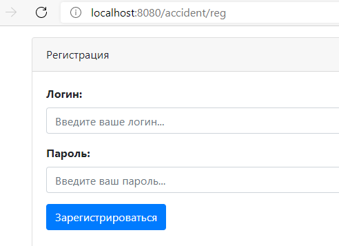
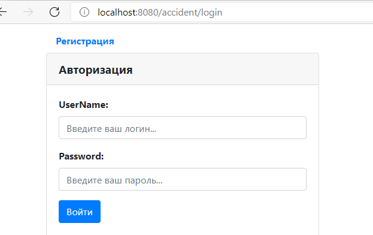
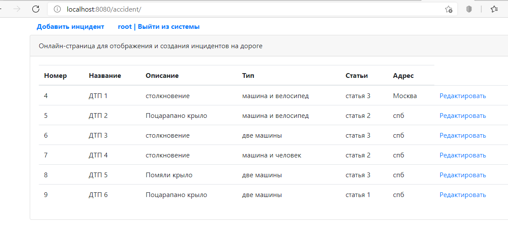
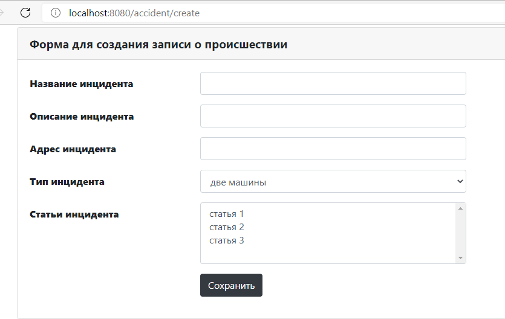
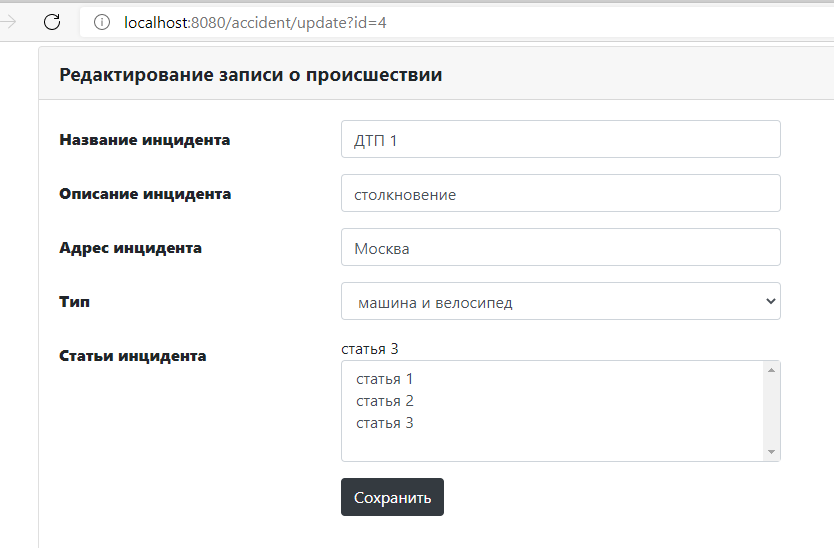
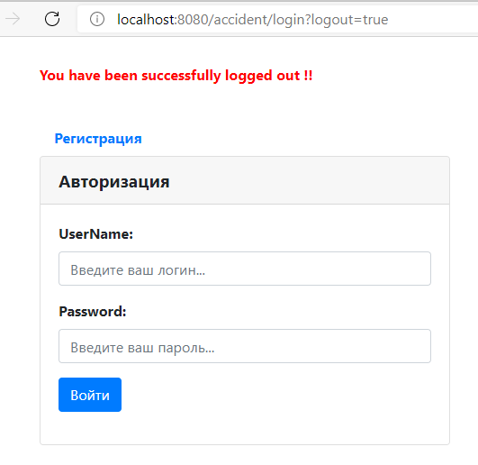

# job4j_car_accident
### Description of the project.
This is the first WEB project on Spring. This webapp realizes car accident area with using of principle of MVC (model-view-controller). Allows you to view the list of auto-incidents, add new ones, and edit those already saved in the database.

### Used technologies:
- Java Core
- Spring Data as framework for data base
- Spring MVC
- Spring Security for authentication.
- Spring Test
- Slf4j for logging.
- Maven as a build system
- PostgresSQL
- Front(jsp/jstl/js/HTML/bootstrap/CSS/Jquery)
- Tomcat as a servlet container
- CI/CD Travis
- Checkstyle
- Jacoco

### Steps of work
After you pushed webapp, you can use it. Steps of work are next:

1. Person Registration
   
   

2. Authorization
   
   

3.View all ads

4.Create the new ad of accident

5.Update your ad of accident

6.Logout

